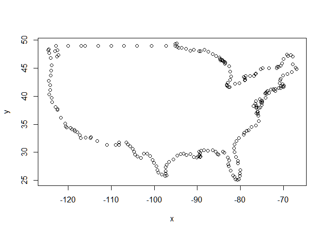

Untitled
================

``` r
library(tidyverse)
```

    ## Warning: package 'tidyverse' was built under R version 4.0.3

    ## -- Attaching packages --------------------------------------- tidyverse 1.3.0 --

    ## <U+221A> ggplot2 3.3.3     <U+221A> purrr   0.3.4
    ## <U+221A> tibble  3.0.4     <U+221A> dplyr   1.0.2
    ## <U+221A> tidyr   1.1.2     <U+221A> stringr 1.4.0
    ## <U+221A> readr   1.4.0     <U+221A> forcats 0.5.0

    ## Warning: package 'ggplot2' was built under R version 4.0.5

    ## Warning: package 'tibble' was built under R version 4.0.3

    ## Warning: package 'tidyr' was built under R version 4.0.3

    ## Warning: package 'readr' was built under R version 4.0.3

    ## Warning: package 'purrr' was built under R version 4.0.3

    ## Warning: package 'dplyr' was built under R version 4.0.3

    ## Warning: package 'stringr' was built under R version 4.0.3

    ## Warning: package 'forcats' was built under R version 4.0.3

    ## -- Conflicts ------------------------------------------ tidyverse_conflicts() --
    ## x dplyr::filter() masks stats::filter()
    ## x dplyr::lag()    masks stats::lag()

``` r
library(ggplot2)
library(plotly)
```

    ## 
    ## Attaching package: 'plotly'

    ## The following object is masked from 'package:ggplot2':
    ## 
    ##     last_plot

    ## The following object is masked from 'package:stats':
    ## 
    ##     filter

    ## The following object is masked from 'package:graphics':
    ## 
    ##     layout

``` r
library(ggmap)
```

    ## Warning: package 'ggmap' was built under R version 4.0.3

    ## Google's Terms of Service: https://cloud.google.com/maps-platform/terms/.

    ## Please cite ggmap if you use it! See citation("ggmap") for details.

    ## 
    ## Attaching package: 'ggmap'

    ## The following object is masked from 'package:plotly':
    ## 
    ##     wind

``` r
library(maps)
```

    ## Warning: package 'maps' was built under R version 4.0.3

    ## 
    ## Attaching package: 'maps'

    ## The following object is masked from 'package:purrr':
    ## 
    ##     map

``` r
library(tmap)
```

    ## Warning: package 'tmap' was built under R version 4.0.3

``` r
wards<-readRDS("wards.rds")
str(wards)
```

    ## 'data.frame':    4189 obs. of  8 variables:
    ##  $ ward                   : Factor w/ 9 levels "1","2","3","4",..: 1 1 1 1 1 1 1 1 1 1 ...
    ##  $ lon                    : num  -123 -123 -123 -123 -123 ...
    ##  $ lat                    : num  44.6 44.6 44.6 44.6 44.6 ...
    ##  $ group                  : Factor w/ 19 levels "0.1","0.2","0.3",..: 1 1 1 1 1 1 1 1 1 1 ...
    ##  $ order                  : int  1 2 3 4 5 6 7 8 9 10 ...
    ##  $ num_sales              : int  159 159 159 159 159 159 159 159 159 159 ...
    ##  $ avg_price              : num  311627 311627 311627 311627 311627 ...
    ##  $ avg_finished_squarefeet: num  1609 1609 1609 1609 1609 ...

``` r
summary(wards)
```

    ##       ward           lon              lat            group     
    ##  9      :1118   Min.   :-123.3   Min.   :44.52   7.1    :1118  
    ##  8      : 789   1st Qu.:-123.3   1st Qu.:44.55   6.1    : 776  
    ##  1      : 773   Median :-123.3   Median :44.59   0.1    : 696  
    ##  6      : 324   Mean   :-123.3   Mean   :44.58   2.1    : 309  
    ##  3      : 318   3rd Qu.:-123.3   3rd Qu.:44.60   4.1    : 302  
    ##  7      : 279   Max.   :-123.2   Max.   :44.61   8.1    : 254  
    ##  (Other): 588                                    (Other): 734  
    ##      order          num_sales       avg_price      avg_finished_squarefeet
    ##  Min.   :   1.0   Min.   : 35.0   Min.   :218078   Min.   : 962.9         
    ##  1st Qu.: 118.0   1st Qu.:109.0   1st Qu.:231982   1st Qu.:1376.6         
    ##  Median : 253.0   Median :135.0   Median :311627   Median :1609.2         
    ##  Mean   : 344.4   Mean   :126.4   Mean   :369971   Mean   :1569.5         
    ##  3rd Qu.: 545.0   3rd Qu.:153.0   3rd Qu.:327688   3rd Qu.:1946.5         
    ##  Max.   :1118.0   Max.   :159.0   Max.   :941471   Max.   :1955.3         
    ## 

``` r
ggplot(wards, aes(lon, lat))+
  geom_point(aes(color=group))
```

<!-- -->

``` r
ggplot(wards, aes(lon, lat))+
  geom_point(aes(color=group))+
  geom_path(aes(group=group))
```

<!-- -->

``` r
ggplot(wards, aes(lon, lat))+
  geom_polygon(aes(fill=ward, group=group))
```

<!-- -->

``` r
#2
#a
corval<-get_stamenmap( bbox = c(left = -123.5, bottom = 44.5, right = -123, top = 44.75),
                       zoom = 10, maptype = "terrain")
```

    ## Source : http://tile.stamen.com/terrain/10/160/369.png

    ## Source : http://tile.stamen.com/terrain/10/161/369.png

    ## Source : http://tile.stamen.com/terrain/10/162/369.png

    ## Source : http://tile.stamen.com/terrain/10/160/370.png

    ## Source : http://tile.stamen.com/terrain/10/161/370.png

    ## Source : http://tile.stamen.com/terrain/10/162/370.png

``` r
ggmap(corval)
```

<!-- -->

``` r
ggmap(corval,
      base_layer = ggplot(wards, aes(lon, lat)), extent="normal", maprange=FALSE) +
  geom_polygon(aes(group = group, fill = ward))
```

<!-- -->

``` r
#b
ggmap(corval,
      base_layer = ggplot(wards, aes(lon, lat)),
      extent = "normal", maprange = FALSE) +
  geom_polygon(aes(group = group, fill = num_sales))
```

<!-- -->

``` r
ggmap(corval,
      base_layer = ggplot(wards, aes(lon, lat)),
      extent = "normal", maprange = FALSE) +
  geom_polygon(aes(group = group, fill = avg_price), alpha=0.8)
```

<!-- -->

``` r
#corval<-get_map(location = c(lon = -123.5, lat = 44.5),
#                zoom = "auto", scale = "auto", maptype = "terrain",
#                source = "google",color = "bw")

australia<-get_stamenmap( bbox = c(left = 107, bottom = -45, right = 160, top = -8.9),
                          zoom=5, maptype = "toner-lite")
```

    ## Source : http://tile.stamen.com/toner-lite/5/25/16.png

    ## Source : http://tile.stamen.com/toner-lite/5/26/16.png

    ## Source : http://tile.stamen.com/toner-lite/5/27/16.png

    ## Source : http://tile.stamen.com/toner-lite/5/28/16.png

    ## Source : http://tile.stamen.com/toner-lite/5/29/16.png

    ## Source : http://tile.stamen.com/toner-lite/5/30/16.png

    ## Source : http://tile.stamen.com/toner-lite/5/25/17.png

    ## Source : http://tile.stamen.com/toner-lite/5/26/17.png

    ## Source : http://tile.stamen.com/toner-lite/5/27/17.png

    ## Source : http://tile.stamen.com/toner-lite/5/28/17.png

    ## Source : http://tile.stamen.com/toner-lite/5/29/17.png

    ## Source : http://tile.stamen.com/toner-lite/5/30/17.png

    ## Source : http://tile.stamen.com/toner-lite/5/25/18.png

    ## Source : http://tile.stamen.com/toner-lite/5/26/18.png

    ## Source : http://tile.stamen.com/toner-lite/5/27/18.png

    ## Source : http://tile.stamen.com/toner-lite/5/28/18.png

    ## Source : http://tile.stamen.com/toner-lite/5/29/18.png

    ## Source : http://tile.stamen.com/toner-lite/5/30/18.png

    ## Source : http://tile.stamen.com/toner-lite/5/25/19.png

    ## Source : http://tile.stamen.com/toner-lite/5/26/19.png

    ## Source : http://tile.stamen.com/toner-lite/5/27/19.png

    ## Source : http://tile.stamen.com/toner-lite/5/28/19.png

    ## Source : http://tile.stamen.com/toner-lite/5/29/19.png

    ## Source : http://tile.stamen.com/toner-lite/5/30/19.png

    ## Source : http://tile.stamen.com/toner-lite/5/25/20.png

    ## Source : http://tile.stamen.com/toner-lite/5/26/20.png

    ## Source : http://tile.stamen.com/toner-lite/5/27/20.png

    ## Source : http://tile.stamen.com/toner-lite/5/28/20.png

    ## Source : http://tile.stamen.com/toner-lite/5/29/20.png

    ## Source : http://tile.stamen.com/toner-lite/5/30/20.png

``` r
ggmap(australia)
```

<!-- -->

``` r
#3
countries<-readRDS("countries_sp.rds")
print(countries)
```

    ## class       : SpatialPolygons 
    ## features    : 177 
    ## extent      : -180, 180, -89.9999, 83.64513  (xmin, xmax, ymin, ymax)
    ## crs         : +proj=longlat +datum=WGS84 +no_defs +ellps=WGS84 +towgs84=0,0,0

``` r
summary(countries)
```

    ##          Length           Class            Mode 
    ##             177 SpatialPolygons              S4

``` r
#str(countries)
#plot(countries)

countries_spdf<-readRDS("countries_spdf.rds")

usa<-countries_spdf@polygons[[169]]
str(usa, max.level=2)
```

    ## Formal class 'Polygons' [package "sp"] with 5 slots
    ##   ..@ Polygons :List of 10
    ##   ..@ plotOrder: int [1:10] 6 10 7 9 1 8 2 4 5 3
    ##   ..@ labpt    : num [1:2] -99.1 39.5
    ##   ..@ ID       : chr "168"
    ##   ..@ area     : num 1122

``` r
str(usa@Polygons, max.level = 2)
```

    ## List of 10
    ##  $ :Formal class 'Polygon' [package "sp"] with 5 slots
    ##  $ :Formal class 'Polygon' [package "sp"] with 5 slots
    ##  $ :Formal class 'Polygon' [package "sp"] with 5 slots
    ##  $ :Formal class 'Polygon' [package "sp"] with 5 slots
    ##  $ :Formal class 'Polygon' [package "sp"] with 5 slots
    ##  $ :Formal class 'Polygon' [package "sp"] with 5 slots
    ##  $ :Formal class 'Polygon' [package "sp"] with 5 slots
    ##  $ :Formal class 'Polygon' [package "sp"] with 5 slots
    ##  $ :Formal class 'Polygon' [package "sp"] with 5 slots
    ##  $ :Formal class 'Polygon' [package "sp"] with 5 slots

``` r
str(usa@Polygons[[6]], max.level = 2)
```

    ## Formal class 'Polygon' [package "sp"] with 5 slots
    ##   ..@ labpt  : num [1:2] -99.1 39.5
    ##   ..@ area   : num 840
    ##   ..@ hole   : logi FALSE
    ##   ..@ ringDir: int 1
    ##   ..@ coords : num [1:233, 1:2] -94.8 -94.6 -94.3 -93.6 -92.6 ...
    ##   .. ..- attr(*, "dimnames")=List of 2

``` r
plot(usa@Polygons[[6]]@coords)
```

<!-- -->

``` r
qtm(shp=countries_spdf, fill="gdp")
```

    ## Warning: package 'sf' was built under R version 4.0.3

    ## Linking to GEOS 3.8.0, GDAL 3.0.4, PROJ 6.3.1

<!-- -->

``` r
tm_shape(countries_spdf) +
  tm_fill(col = "population", style = "quantile") +
  tm_borders(col = "burlywood4")
```

<!-- -->

``` r
tm_shape(countries_spdf) +
  tm_bubbles(size = "population", style = "quantile") +
  tm_borders(col = "burlywood4")
```

<!-- -->

``` r
tm_shape(countries_spdf) +
  tm_grid(n.x = 11, n.y = 11) +
  tm_fill(col = "population", style = "quantile") +
  tm_borders(col = "burlywood4") +
  tm_style("classic")
```

<!-- -->

``` r
tmap_save( filename="population.png")
```

    ## Map saved to D:\AGH\Programowanie R zajecia\WizualizacjaDanychR\Zajecia13\population.png

    ## Resolution: 3053.966 by 1444.024 pixels

    ## Size: 10.17989 by 4.813413 inches (300 dpi)

``` r
#tmap_save( filename="population.html")

#4
dfb <- world.cities[world.cities$country.etc=="Poland",]
dfb$poph <- paste(dfb$name, "Pop", round(dfb$pop/1e6,2), " millions")
dfb$q <- with(dfb, cut(pop, quantile(pop), include.lowest = T))
levels(dfb$q) <- paste(c("1st", "2nd", "3rd", "4th"), "Quantile")
dfb$q <- as.ordered(dfb$q)
ge <- list(
  scope = 'europe',
  showland = TRUE,
  landcolor = toRGB("gray85"),
  subunitwidth = 1,
  countrywidth = 1,
  subunitcolor = toRGB("white"),
  countrycolor = toRGB("black")
)
plot_geo(dfb, lon = ~long, lat = ~lat, text = ~poph,
         marker = ~list(size = sqrt(pop/10000) + 1, line = list(width = 0)),
         color = ~q, locationmode = "country names") %>%
  layout(geo = ge, title = "Populations<br>(in millions) ")
```

    ## No scattergeo mode specifed:
    ##   Setting the mode to markers
    ##   Read more about this attribute -> https://plotly.com/r/reference/#scatter-mode

<!--html_preserve-->

<div id="htmlwidget-5ceb0abf3787b5dbd94f" class="plotly html-widget"
style="width:672px;height:480px;">

</div>

<script type="application/json" data-for="htmlwidget-5ceb0abf3787b5dbd94f">{"x":{"visdat":{"46301c826884":["function () ","plotlyVisDat"]},"cur_data":"46301c826884","attrs":{"46301c826884":{"lon":{},"lat":{},"text":{},"marker":{},"locationmode":"country names","color":{},"alpha_stroke":1,"sizes":[10,100],"spans":[1,20],"x":{},"y":{}}},"layout":{"margin":{"b":40,"l":60,"t":25,"r":10},"mapType":"geo","geo":{"domain":{"x":[0,1],"y":[0,1]},"scope":"europe","showland":true,"landcolor":"rgba(217,217,217,1)","subunitwidth":1,"countrywidth":1,"subunitcolor":"rgba(255,255,255,1)","countrycolor":"rgba(0,0,0,1)"},"title":"Populations<br>(in millions) ","hovermode":"closest","showlegend":true},"source":"A","config":{"showSendToCloud":false},"data":[{"lon":[19.13,19.36,23.11,23.16,19.05,15.56,18.01,18.91,19.03,20.62,19.96,19.13,19.18,21.42,19.4,22.36,18.64,18.53,18.67,16.08,17.61,15.23,18.75,18.25,22.68,18.59,19.27,15.73,18.1,19.02,18.21,23.49,20.65,15.57,18.25,16.18,21.76,19.36,20.92,16.16,16.57,19.46,22.07,16.2,22.57,21.43,19.14,15.71,20.7,17.34,20.49,17.94,21.57,17.8,21.39,19.26,21.28,19.35,22.78,18.96,16.74,19.7,19.7,16.9,20.82,21.98,18.22,21.16,19.44,18.88,18.37,18.55,22,22.28,19.05,18.74,20.88,20.14,17.02,19.12,22.05,21.07,15.02,18.52,22.94,16.49,18.94,14.25,14.53,21.68,20.99,18.86,18.78,20.03,18.61,19,16.28,21.02,18.23,19.06,18.47,17.03,18.78,23.26,19.42,18.94,19.41,15.49,18.69,20.45],"lat":[50.34,51.37,52.04,53.14,49.82,51.26,53.12,50.35,50.3,52.88,50.06,50.81,50.33,50.06,54.18,53.83,54.36,54.52,50.31,51.67,52.53,52.74,53.49,52.78,50.02,49.99,50.21,50.91,51.77,50.26,50.34,51.14,50.89,54.19,52.21,54.19,49.7,52.24,52.41,51.21,51.85,51.77,53.18,51.4,51.24,50.29,50.24,51.81,49.63,50.48,53.78,50.68,53.09,51.66,50.95,50.04,52.11,51.67,49.79,50.4,53.15,51.41,52.55,52.4,52.22,51.43,50.09,51.4,51.07,50.3,54.59,50.1,50.05,52.17,50.33,51.6,51.12,51.96,54.47,50.28,50.57,51.06,53.34,53.97,54.11,50.85,50.29,53.91,53.43,50.59,50.01,50.46,54.1,51.54,53.02,50.16,50.78,52.26,54.6,52.66,50,51.11,50.3,50.73,50.49,51.61,51.87,51.94,50.07,52.06],"text":["Bedzin Pop 0.06  millions","Belchatow Pop 0.06  millions","Biala Podlaska Pop 0.06  millions","Bialystok Pop 0.29  millions","Bielsko-Biala Pop 0.18  millions","Boleslawiec Pop 0.04  millions","Bydgoszcz Pop 0.36  millions","Bytom Pop 0.19  millions","Chorzow Pop 0.11  millions","Ciechanow Pop 0.05  millions","Cracow Pop 0.75  millions","Czestochowa Pop 0.25  millions","Dabrowa Gornicza Pop 0.13  millions","Debica Pop 0.05  millions","Elblag Pop 0.13  millions","Elk Pop 0.06  millions","Gdansk Pop 0.46  millions","Gdynia Pop 0.25  millions","Gliwice Pop 0.2  millions","Glogow Pop 0.07  millions","Gniezno Pop 0.07  millions","Gorzow Wielkopolski Pop 0.12  millions","Grudziadz Pop 0.1  millions","Inowroclaw Pop 0.08  millions","Jaroslaw Pop 0.04  millions","Jastrzebie-Zdroj Pop 0.1  millions","Jaworzno Pop 0.1  millions","Jelenia Gora Pop 0.09  millions","Kalisz Pop 0.11  millions","Katowice Pop 0.31  millions","Kedzierzyn-Kozle Pop 0.07  millions","Kholm Pop 0.07  millions","Kielce Pop 0.21  millions","Kolobrzeg Pop 0.04  millions","Konin Pop 0.08  millions","Koszalin Pop 0.11  millions","Krosno Pop 0.05  millions","Kutno Pop 0.05  millions","Legionowo Pop 0.05  millions","Legnica Pop 0.11  millions","Leszno Pop 0.06  millions","Lodz Pop 0.76  millions","Lomza Pop 0.06  millions","Lubin Pop 0.08  millions","Lublin Pop 0.36  millions","Mielec Pop 0.06  millions","Myslowice Pop 0.08  millions","Nowa Sol Pop 0.04  millions","Nowy Sacz Pop 0.08  millions","Nysa Pop 0.05  millions","Olsztyn Pop 0.17  millions","Opole Pop 0.13  millions","Ostroleka Pop 0.05  millions","Ostrow Wielkopolski Pop 0.07  millions","Ostrowiec Swietokrzyski Pop 0.07  millions","Oswiecim Pop 0.04  millions","Otwock Pop 0.04  millions","Pabianice Pop 0.07  millions","Peremyshl Pop 0.07  millions","Piekary Slaskie Pop 0.06  millions","Pila Pop 0.08  millions","Piotrkow Trybunalski Pop 0.08  millions","Plock Pop 0.13  millions","Poznan Pop 0.57  millions","Pruszkow Pop 0.05  millions","Pulawy Pop 0.05  millions","Raciborz Pop 0.06  millions","Radom Pop 0.23  millions","Radomsko Pop 0.05  millions","Ruda Slaska Pop 0.14  millions","Rumia Pop 0.05  millions","Rybnik Pop 0.14  millions","Rzeszow Pop 0.16  millions","Siedlce Pop 0.08  millions","Siemianowice Slaskie Pop 0.07  millions","Sieradz Pop 0.04  millions","Skarzysko-Kamienna Pop 0.05  millions","Skierniewice Pop 0.05  millions","Slupsk Pop 0.1  millions","Sosnowiec Pop 0.23  millions","Stalowa Wola Pop 0.07  millions","Starachowice Pop 0.05  millions","Stargard Szczecinski Pop 0.07  millions","Starogard Gdanski Pop 0.05  millions","Suwalki Pop 0.07  millions","Swidnica Pop 0.06  millions","Swietochlowice Pop 0.06  millions","Swinoujscie Pop 0.04  millions","Szczecin Pop 0.41  millions","Tarnobrzeg Pop 0.05  millions","Tarnow Pop 0.12  millions","Tarnowskie Gory Pop 0.06  millions","Tczew Pop 0.06  millions","Tomaszow Mazowiecki Pop 0.07  millions","Torun Pop 0.21  millions","Tychy Pop 0.13  millions","Walbrzych Pop 0.13  millions","Warsaw Pop 1.63  millions","Wejherowo Pop 0.04  millions","Wloclawek Pop 0.12  millions","Wodzislaw Slaski Pop 0.05  millions","Wroclaw Pop 0.63  millions","Zabrze Pop 0.19  millions","Zamosc Pop 0.07  millions","Zawiercie Pop 0.05  millions","Zdunska Wola Pop 0.04  millions","Zgierz Pop 0.06  millions","Zielona Gora Pop 0.12  millions","Zory Pop 0.06  millions","Zyrardow Pop 0.04  millions"],"marker":{"color":"rgba(253,231,37,1)","size":[2.23608252151707,2.99047732968753,5.750726260268,2.74407568643107,2.47699018277035,3.5741600571837,3.31289861429333,3.66872628795086,3.18986300941406,1.94615009380119,2.24298028946561,2.30345694213503,1.99388128063668,2.41689802032468,2.11162043881893,1.992169340385,1.96109312764165,2.34357731448547,2.00856333464984,2.37065677687742,3.63353374764783,2.70853738618738,3.45059176526814,3.00102473747828,2.26771447889499,2.52078926876803,2.47492372684149,2.60679805825125,3.35265807120372,3.01680440300987,2.04019228991567,2.36301137192615,7.42927678670004,2.95601635984978,2.61052786377635,2.12960169971544,2.00109939566459,1.95629493358482,2.09995454451536,3.24953328492823,4.42235299172952,3.45965444727506,3.45422085395752,2.40943250991312,3.59019304299892,5.56059206682641,2.3039555207138,2.01877377272876,2.36780846612382,2.10756489651848,2.16584733134317,2.71554656013761,4.62448617047989,2.27291005181042,2.25475097130865,1.98020406038743,2.1805083650699,2.38358230691202,2.56396930916179,4.55780831411699,2.60670470217772,2.0519980988576,13.7845258027038,2.09183332061263,2.11834699445208,3.09317939986041,2.3720058308914,2.55913437522235,2.06583300755794,2.22368296547758,4.46538598138793,2.13450429703902,2.03053384223906,3.22355571101783,1.97943861471764,1.9547250913221,2.91373979422491,2.10761003968003,2.16995726417677,8.95786403502849,2.0760576192751,2.69508111900286,2.20112447315006,1.95958324287161,2.63275840221387,2.54977417709807,2.27557830022308,5.37333968495474,2.615704180845,2.65499244711267,2.51092686785297,3.56339618475178,2.96479006512146,1.91203070123763,3.29989130177928,3.10589648368575,2.15368973298717,3.40678208402838,2.81895574437643,1.96156123049965,4.44325427466518,2.33337916587893,2.15047816146157,2.28802173894698,2.35793961574144,2.1815667564721,3.5118120948829,1.93413061185254,3.02538885155419,2.7861970775925],"line":{"color":"rgba(253,231,37,1)","width":0}},"locationmode":"country names","type":"scattergeo","mode":"markers","name":"4th Quantile","textfont":{"color":"rgba(253,231,37,1)"},"line":{"color":"rgba(253,231,37,1)"},"geo":"geo","frame":null},{"lon":[19.3,19.34,23,20.81,15.98,16.61,23.29,22.73,20.43,19.4,17.47,18.43,17.57,19.4,18.63,19.02,19.13,18.68,20.18,16.65,21.76,14.82,21.16,17,22.44,20.62,14.48,23.58,19.56,17.5,21.47,16.2,16.03,21.37,16.66,18.21,18.67,18.64,20.4,16.64,17.97,22.22,17.43,18.93,18.78,17.75,22.87,19.93,15.28,22.61,18.69,16.87,22.39,19.04,21.11,18.97,21.56,20.36,21.3,19.32,16.5,20.71,20.03,17.3,17.38,19.55,20.28,19.96,21.9,19.29,21.02,20.92,20.38,14.56,16.05,17.58,18.64,18.95,16.86,18.43,21.74,22.21,19.83,20.23,18.56,17.01,17.27,18.3,17.07,22.79,16.33,15.53,18.44,16.69,20.99,18.48,17.2,16.47,18.57,21.23,17.58,21.45,21.11,15.3,19.96,22.24,15.13,15.01,19.18],"lat":[51.82,49.86,53.84,54.25,54.01,50.69,52.78,50.54,49.98,53.26,50.85,53.35,53.7,50.14,49.75,49.91,50.32,50.17,53.23,50.73,54.04,53.57,49.67,51.88,53.65,52.11,53.23,52.73,53.59,51.98,49.74,51.06,50.79,54.08,50.44,50.98,50.22,52.2,51.2,52.09,54.13,50.93,51.7,53.74,50.17,54.55,51.31,52.11,51.12,51.46,50.67,52.34,51.94,54.04,52.33,50.23,52.18,53.12,53.88,50.58,50.59,52.43,49.49,50.94,51.21,50.28,51.38,53.71,52.8,51.97,52.07,52.21,52.63,53.55,51.5,50.32,54.27,49.98,51.61,50.07,50.69,49.57,49.98,52.23,54.44,52.09,52.22,50.52,52.41,51.22,50.86,52.26,53.4,53.71,53.56,52.02,52.81,53.27,51.22,52.34,52.32,52.6,52.29,51.62,49.29,52.98,51.65,51.15,49.87],"text":["Aleksandrow Lodzki Pop 0.02  millions","Andrychow Pop 0.02  millions","Augustow Pop 0.03  millions","Bartoszyce Pop 0.03  millions","Bialogard Pop 0.02  millions","Bielawa Pop 0.03  millions","Bielsk Podlaski Pop 0.03  millions","Bilgoraj Pop 0.03  millions","Bochnia Pop 0.03  millions","Brodnica Pop 0.03  millions","Brzeg Pop 0.04  millions","Chelmno Pop 0.02  millions","Chojnice Pop 0.04  millions","Chrzanow Pop 0.04  millions","Cieszyn Pop 0.04  millions","Czechowice-Dziedzice Pop 0.03  millions","Czeladz Pop 0.03  millions","Czerwionka-Leszczyny Pop 0.03  millions","Dzialdowo Pop 0.02  millions","Dzierzoniow Pop 0.03  millions","Gizycko Pop 0.03  millions","Goleniow Pop 0.02  millions","Gorlice Pop 0.03  millions","Gostyn Pop 0.02  millions","Grajewo Pop 0.02  millions","Grodzisk Mazowiecki Pop 0.03  millions","Gryfino Pop 0.02  millions","Hajnowka Pop 0.02  millions","Ilawa Pop 0.03  millions","Jarocin Pop 0.03  millions","Jaslo Pop 0.04  millions","Jawor Pop 0.02  millions","Kamienna Gora Pop 0.02  millions","Ketrzyn Pop 0.03  millions","Klodzko Pop 0.03  millions","Kluczbork Pop 0.03  millions","Knurow Pop 0.04  millions","Kolo Pop 0.02  millions","Konskie Pop 0.02  millions","Koscian Pop 0.02  millions","Koscierzyna Pop 0.02  millions","Krasnik Pop 0.04  millions","Krotoszyn Pop 0.03  millions","Kwidzyn Pop 0.04  millions","Laziska Gorne Pop 0.02  millions","Lebork Pop 0.04  millions","Leczna Pop 0.02  millions","Lowicz Pop 0.03  millions","Luban Pop 0.02  millions","Lubartow Pop 0.02  millions","Lubliniec Pop 0.02  millions","Lubon Pop 0.03  millions","Lukow Pop 0.03  millions","Malbork Pop 0.04  millions","Marki Pop 0.02  millions","Mikolow Pop 0.04  millions","Minsk Mazowiecki Pop 0.04  millions","Mlawa Pop 0.03  millions","Mragowo Pop 0.02  millions","Myszkow Pop 0.03  millions","Nowa Ruda Pop 0.02  millions","Nowy Dwor Mazowiecki Pop 0.03  millions","Nowy Targ Pop 0.03  millions","Olawa Pop 0.03  millions","Olesnica Pop 0.04  millions","Olkusz Pop 0.04  millions","Opoczno Pop 0.02  millions","Ostroda Pop 0.03  millions","Ostrow Mazowiecka Pop 0.02  millions","Ozorkow Pop 0.02  millions","Piaseczno Pop 0.04  millions","Piastow Pop 0.02  millions","Plonsk Pop 0.02  millions","Police Pop 0.03  millions","Polkowice Pop 0.02  millions","Prudnik Pop 0.02  millions","Pruszcz Gdanski Pop 0.02  millions","Pszczyna Pop 0.03  millions","Rawicz Pop 0.02  millions","Rydultowy Pop 0.02  millions","Sandomierz Pop 0.02  millions","Sanok Pop 0.04  millions","Skawina Pop 0.02  millions","Sochaczew Pop 0.04  millions","Sopot Pop 0.04  millions","Srem Pop 0.03  millions","Sroda Wielkopolska Pop 0.02  millions","Strzelce Opolskie Pop 0.02  millions","Swarzedz Pop 0.03  millions","Swidnik Pop 0.04  millions","Swiebodzice Pop 0.02  millions","Swiebodzin Pop 0.02  millions","Swiecie Pop 0.03  millions","Szczecinek Pop 0.04  millions","Szczytno Pop 0.03  millions","Turek Pop 0.03  millions","Wagrowiec Pop 0.02  millions","Walcz Pop 0.03  millions","Wielun Pop 0.02  millions","Wolomin Pop 0.04  millions","Wrzesnia Pop 0.03  millions","Wyszkow Pop 0.03  millions","Zabki Pop 0.02  millions","Zagan Pop 0.03  millions","Zakopane Pop 0.03  millions","Zambrow Pop 0.02  millions","Zary Pop 0.04  millions","Zgorzelec Pop 0.03  millions","Zywiec Pop 0.03  millions"],"marker":{"color":"rgba(53,183,121,1)","size":[2.24731712086382,2.07312627402371,2.5703184390435,3.00309760121668,2.04914250700274,2.29154945704762,1.98742088290657,2.66502252237019,3.90389393745708,2.84363770844491,2.2280879447336,3.189520495451,2.33764718816286,2.76085206647237,2.26003968191482,2.92010416384112,2.00895986045036,2.93920086633644,5.14061589621641,1.94657276529594,2.50289720207338,4.56527698783699,1.93445171089789,1.97015462685079,2.35535973084639,2.82931681236466,3.31484340723082,2.50741500589585,3.69657189779913,3.71092235226316,2.20099958368019,3.02207813894518,3.06925107224812,1.99252204005755,2.43111844373553,3.64232851856085,2.01079176886241,2.11067547015319,3.58414395883821,2.93261480900877,2.52216950435883,3.43758076789263,1.96643675426797,3.75167221885166,2.08194269718872,2.40840335131666,3.82612809334609,2.38701117515325,2.32223295980701,4.56672118338398,2.49046972461704,1.89420355624433,1.92994623500501,2.85226887896979,2.46543508897528,1.99959991996798,1.93080610225761,8.53629219178768,2.52538519725347,2.54622120021684,3.34452553835526,2.29139459500185,2.25757703541374,2.58540215718284,2.1824127874816,2.07060730429042,3.22515168022317,2.37811465415618,2.13701363228415,2.37302585554679,2.14258478897629,3.41186649713453,2.31912850018488,5.75311476823356,3.21282624713284,2.30663690442295,2.26629380477044,2.33195345264014,2.46164291124748,2.3538833036861,2.0403845442912,2.24153131253303,4.80659953239108,3.12428811605206,4.77457282351262,2.47807306991231,1.97826376811165,2.28860389569487,4.97468237724727,2.57876534038469,2.99052756825923,1.9619771307053,3.77166015232748,3.69779539624487,2.24330205501318,3.10656117879353,2.37379037702264,3.21569402219711,2.53583853317984,3.21831016767268,2.21486624778203,2.00059982010792,2.15792918609041,2.32879644791819,2.20411793442337,4.13376770038878,2.95537720146267,2.38014491992689,2.35096261976414],"line":{"color":"rgba(53,183,121,1)","width":0}},"locationmode":"country names","type":"scattergeo","mode":"markers","name":"3rd Quantile","textfont":{"color":"rgba(53,183,121,1)"},"line":{"color":"rgba(53,183,121,1)"},"geo":"geo","frame":null},{"lon":[15.2,19.1,14.96,16.19,19.82,20.6,20.72,17.47,18.61,16.91,15.93,15.4,17.35,16.41,21.83,21.62,19.7,17.83,17.37,22.31,19.43,16.36,20.86,15.19,14.72,23.89,20.3,17.3,21.26,18.2,18,19.22,21.2,21.11,19.32,14.65,21.55,17.96,23.18,22.23,22.89,19.14,19.2,19.06,22.42,19.29,20.59,20.42,19.17,20.89,14.96,22.78,15.57,20.66,19.93,19.94,17.6,17.72,20.43,22.14,15.11,16.12,16.81,22.51,18.78,17.95,21.46,21.8,17.78,20.88,22.5,18.4,21.09,18.62,18.46,18.89,22.62,20.26,18.34,21.75,19.41,22.87,19.65,18.8,14.57,17.88,23.5,22.24,18.23,21.18,16.35,15.62,21.27,15.78,16.58,23.42,16.46,19.45,16.85,18.8,18.94,19.49,20.09,18.4,16.32,16.82,21.17,15.91,17.03,17.71],"lat":[53,50.1,50.92,50.76,54.39,49.97,50.48,54.18,53.18,52.99,51.28,53.18,53.67,54.42,51.57,51.91,51.98,50.19,50.32,54.31,53.43,52.23,51.88,53.92,51.96,50.81,50.65,51.03,52.15,54.33,51.28,49.87,52.34,52.1,51.75,52.59,51.59,50.48,50.99,50.07,52.99,51.6,52.07,50.13,50.26,50.1,54.14,49.71,52.84,52.35,51.79,51.99,52.45,52.13,53.92,49.84,53.14,51.08,53.37,50.53,53.66,52.31,52.65,54.04,50.16,51.42,51.49,53.63,51.91,53.01,50.07,50.04,52.71,50.41,50.04,50.39,51.79,51.77,54.62,50.07,53.07,52.42,52.86,49.8,52.36,52.29,53.4,52.41,53.07,50.56,50.96,52.09,52.25,53.77,52.61,50.46,53.04,50.16,54.58,49.72,53.28,49.88,49.99,54.79,51.8,50.59,52.3,51.12,53.36,52.85],"text":["Barlinek Pop 0.01  millions","Bierun Pop 0.02  millions","Bogatynia Pop 0.02  millions","Boguszow-Gorce Pop 0.02  millions","Braniewo Pop 0.02  millions","Brzesko Pop 0.02  millions","Busko-Zdroj Pop 0.02  millions","Bytow Pop 0.02  millions","Chelmza Pop 0.02  millions","Chodziez Pop 0.02  millions","Chojnow Pop 0.01  millions","Choszczno Pop 0.02  millions","Czluchow Pop 0.01  millions","Darlowo Pop 0.01  millions","Deblin Pop 0.02  millions","Garwolin Pop 0.02  millions","Glowno Pop 0.02  millions","Glubczyce Pop 0.01  millions","Glucholazy Pop 0.02  millions","Goldap Pop 0.01  millions","Gostynin Pop 0.02  millions","Grodzisk Wielkopolski Pop 0.01  millions","Grojec Pop 0.01  millions","Gryfice Pop 0.02  millions","Gubin Pop 0.02  millions","Hrubieszow Pop 0.02  millions","Jedrzejow Pop 0.02  millions","Jelcz-Laskowice Pop 0.02  millions","Jozefow Pop 0.02  millions","Kartuzy Pop 0.01  millions","Kepno Pop 0.01  millions","Kety Pop 0.02  millions","Kobylka Pop 0.02  millions","Konstancin-Jeziorna Pop 0.02  millions","Konstantynow Lodzki Pop 0.02  millions","Kostrzyn Pop 0.02  millions","Kozienice Pop 0.02  millions","Krapkowice Pop 0.02  millions","Krasnystaw Pop 0.02  millions","Lancut Pop 0.02  millions","Lapy Pop 0.02  millions","Lask Pop 0.02  millions","Leczyca Pop 0.02  millions","Ledziny Pop 0.02  millions","Lezajsk Pop 0.01  millions","Libiaz Pop 0.02  millions","Lidzbark Warminski Pop 0.02  millions","Limanowa Pop 0.01  millions","Lipno Pop 0.01  millions","Lomianki Pop 0.02  millions","Lubsko Pop 0.01  millions","Miedzyrzec Podlaski Pop 0.02  millions","Miedzyrzecz Pop 0.02  millions","Milanowek Pop 0.02  millions","Morag Pop 0.01  millions","Myslenice Pop 0.02  millions","Naklo nad Notecia Pop 0.02  millions","Namyslow Pop 0.02  millions","Nidzica Pop 0.01  millions","Nisko Pop 0.02  millions","Nowogard Pop 0.02  millions","Nowy Tomysl Pop 0.02  millions","Oborniki Pop 0.02  millions","Olecko Pop 0.02  millions","Orzesze Pop 0.02  millions","Ostrzeszow Pop 0.01  millions","Pionki Pop 0.02  millions","Pisz Pop 0.02  millions","Pleszew Pop 0.02  millions","Przasnysz Pop 0.02  millions","Przeworsk Pop 0.02  millions","Pszow Pop 0.01  millions","Pultusk Pop 0.02  millions","Pyskowice Pop 0.02  millions","Radlin Pop 0.02  millions","Radzionkow Pop 0.02  millions","Radzyn Podlaski Pop 0.02  millions","Rawa Mazowiecka Pop 0.02  millions","Reda Pop 0.02  millions","Ropczyce Pop 0.02  millions","Rypin Pop 0.02  millions","Siemiatycze Pop 0.02  millions","Sierpc Pop 0.02  millions","Skoczow Pop 0.01  millions","Slubice Pop 0.02  millions","Slupca Pop 0.01  millions","Sokolka Pop 0.02  millions","Sokolow Podlaski Pop 0.02  millions","Solec Kujawski Pop 0.02  millions","Staszow Pop 0.02  millions","Strzegom Pop 0.02  millions","Sulechow Pop 0.02  millions","Sulejowek Pop 0.02  millions","Swidwin Pop 0.02  millions","Szamotuly Pop 0.02  millions","Tomaszow Lubelski Pop 0.02  millions","Trzcianka Pop 0.02  millions","Trzebinia Pop 0.02  millions","Ustka Pop 0.02  millions","Ustron Pop 0.02  millions","Wabrzezno Pop 0.01  millions","Wadowice Pop 0.02  millions","Wieliczka Pop 0.02  millions","Wladyslawowo Pop 0.01  millions","Wschowa Pop 0.01  millions","Zabkowice Slaskie Pop 0.02  millions","Zielonka Pop 0.02  millions","Zlotoryja Pop 0.02  millions","Zlotow Pop 0.02  millions","Znin Pop 0.01  millions"],"marker":{"color":"rgba(49,104,142,1)","size":[4.10578492494249,2.29336769713798,2.23887045327589,3.94436750423584,2.35074053763112,1.92973114393356,4.29513277425963,1.94757585448343,2.47231110842784,2.01158291800524,2.21679907955258,6.60644272243996,3.55452539623312,2.2179901477434,2.67332005306815,2.38697512594855,3.60386251557182,5.5549423706563,2.14555663325739,2.68718700801067,2.60667358228111,2.98728457952051,2.33581435835972,2.02927158709448,2.53248164752469,3.10295030849519,2.15425300519427,3.84520649514231,2.43478221343868,2.28984495192252,2.31840813104289,2.04919016388832,2.55228863295458,2.5310780515702,2.35793961574144,4.27284280099121,2.08521887193322,2.36249770642009,1.98498730956292,2.3477017474204,2.88637217960826,2.39552857369529,3.18346055608981,2.09922700112397,2.70897630176665,1.97626840571638,2.10489818535465,1.99629312955575,2.00563412829915,3.19563202745815,2.94036079119323,2.35712932324079,2.27769323391806,2.35440023626696,2.4813844875656,2.87443324767781,2.46938762755101,2.24306073866083,2.26321019628564,3.25614715832102,4.25133818603971,3.52107120089854,2.17741241712494,2.33719856416315,2.28366662338786,2.2172920767014,2.21507201432672,2.02805641868528,9.73278306154458,2.25183864774978,3.52360852748599,2.74057461776277,2.12521109130687,2.48546289081889,2.50797877969154,1.9683491106001,3.7792624921011,7.00931776493805,2.54893511807306,2.64304595188327,2.22294725969684,2.74570902500961,1.97959175170068,1.99784768376742,2.96707905280901,2.54602716664359,2.04110518200612,2.08129551927306,2.04914250700274,2.30744024720061,2.36341483048997,3.46696169406823,2.97083738547857,2.24659536337979,2.10204355630801,2.92994818583298,2.71455533593991,2.11328343201541,2.02601169583977,2.21663470277647,2.10122658885445,2.48108068652589,2.00149887668434,2.32623527324529,2.10027269347194,3.74160536912226,2.8245821439442,2.39767664357676,2.27451951730839,2.21078486941322],"line":{"color":"rgba(49,104,142,1)","width":0}},"locationmode":"country names","type":"scattergeo","mode":"markers","name":"2nd Quantile","textfont":{"color":"rgba(49,104,142,1)"},"line":{"color":"rgba(49,104,142,1)"},"geo":"geo","frame":null},{"lon":[18.7,20.95,18.96,20.62,20.8,16.74,19.15,19.75,19.44,16.64,19.25,18.79,22.58,16.55,17.97,21,14.7,20.39,15.8,15.83,19.04,16.52,21.21,17.37,17.03,22.41,18.9,14.78,21.25,18.94,21.93,19.82,17.93,15.83,15.6,15.1,18.3,20.96,19.63,16.23,15.62,23.12,19.75,15.6,21.1,16.97,20.02,15.9,17.27,17.96,22.78,16.84,17.01,14.87,21.76,19.59,19.12,18.41,16.4,21.97,20.13,18.22,22.9,19.66,16.59,20.53,21.28,16.1,22.12,19.34,18.4,14.88,19.94,16.98,21.93,17.53,15.49,16.67,20.64,15.53,17.07,19.59,20.83,15.11,17.71,15.52,18.96,17.72,20.86,15.26,17.06,17.85,22.61,21.19,21.75,22.01,18.87,23.56,19.97,19.01,19.77,16.63,16.11,16.36,22.51,18.46,18.12,17.05,16,19.62],"lat":[52.88,53.87,50.79,52.2,52.18,51.27,49.99,51.81,50.29,50.3,50.11,52.88,53.59,52.91,53.8,50.18,52.74,53.99,53.53,52.83,53.11,51.67,51.99,50.7,52.43,50.71,50.57,53.97,52.08,50.91,53.42,51.75,53.31,50.8,51.75,52.06,52.68,49.42,50.13,50.43,53.64,50.16,53.5,51.11,52.86,54,50.36,52.61,51.53,52.65,53.4,52.26,52.58,52.93,50.44,53.43,54.22,50.89,52.31,51.15,54.12,50.69,51.64,54.07,50.72,50.54,50.43,53.77,51.18,50.49,54.71,53.14,49.62,52.75,51.64,53.45,52.59,54.35,49.57,52.87,50.78,49.75,51.07,52.45,51.3,51.57,53.85,53.01,51.23,54.07,51.31,53.59,49.43,51.8,54.22,52.4,49.66,51.55,50.86,50.36,50.39,51.33,52.11,52.7,52.91,50.62,50.42,50.6,53.53,52.25],"text":["Aleksandrow Kujawski Pop 0.01  millions","Biskupiec Pop 0.01  millions","Blachowania Pop 0.01  millions","Blonie Pop 0.01  millions","Brwinow Pop 0.01  millions","Brzeg Dolny Pop 0.01  millions","Brzeszcze Pop 0.01  millions","Brzeziny Pop 0.01  millions","Bukowno Pop 0.01  millions","Bystrzyca Klodzka Pop 0.01  millions","Chelmek Pop 0.01  millions","Ciechocinek Pop 0.01  millions","Czarna Bialostocka Pop 0.01  millions","Czarnkow Pop 0.01  millions","Czersk Pop 0.01  millions","Dabrowa Tarnowska Pop 0.01  millions","Debno Pop 0.01  millions","Dobre Miasto Pop 0.01  millions","Drawsko Pomorskie Pop 0.01  millions","Drezdenko Pop 0.01  millions","Golub-Dobrzyn Pop 0.01  millions","Gora Pop 0.01  millions","Gora Kalwaria Pop 0.01  millions","Grodkow Pop 0.01  millions","Janikowo Pop 0.01  millions","Janow Lubelski Pop 0.01  millions","Kalety Pop 0.01  millions","Kamien Pomorski Pop 0.01  millions","Karczew Pop 0.01  millions","Klobuck Pop 0.01  millions","Kolno Pop 0.01  millions","Koluszki Pop 0.01  millions","Koronowo Pop 0.01  millions","Kowary Pop 0.01  millions","Kozuchow Pop 0.01  millions","Krosno Odrzanskie Pop 0.01  millions","Kruszwica Pop 0.01  millions","Krynica-Zdroj Pop 0.01  millions","Krzeszowice Pop 0.01  millions","Kudowa-Zdroj Pop 0.01  millions","Lobez Pop 0.01  millions","Lubaczow Pop 0.01  millions","Lubawa Pop 0.01  millions","Lwowek Slaski Pop 0.01  millions","Makow Mazowiecki Pop 0.01  millions","Miastko Pop 0.01  millions","Miechow Pop 0.01  millions","Miedzychod Pop 0.01  millions","Milicz Pop 0.01  millions","Mogilno Pop 0.01  millions","Monki Pop 0.01  millions","Mosina Pop 0.01  millions","Murowana Goslina Pop 0.01  millions","Mysliborz Pop 0.01  millions","Nowa Deba Pop 0.01  millions","Nowe Miasto Lubawskie Pop 0.01  millions","Nowy Dwor Gdanski Pop 0.01  millions","Olesno Pop 0.01  millions","Opalenica Pop 0.01  millions","Opole Lubelskie Pop 0.01  millions","Orneta Pop 0.01  millions","Ozimek Pop 0.01  millions","Parczew Pop 0.01  millions","Paslek Pop 0.01  millions","Pieszyce Pop 0.01  millions","Pinczow Pop 0.01  millions","Polaniec Pop 0.01  millions","Polczyn-Zdroj Pop 0.01  millions","Poniatowa Pop 0.01  millions","Poreba Pop 0.01  millions","Puck Pop 0.01  millions","Pyrzyce Pop 0.01  millions","Rabka-Zdroj Pop 0.01  millions","Rogozno Pop 0.01  millions","Ryki Pop 0.01  millions","Sepolno Krajenskie Pop 0.01  millions","Skwierzyna Pop 0.01  millions","Slawno Pop 0.01  millions","Stary Sacz Pop 0.01  millions","Strzelce Krajenskie Pop 0.01  millions","Strzelin Pop 0.01  millions","Sucha Beskidzka Pop 0.01  millions","Suchedniow Pop 0.01  millions","Sulecin Pop 0.01  millions","Sycow Pop 0.01  millions","Szprotawa Pop 0.01  millions","Sztum Pop 0.01  millions","Szubin Pop 0.01  millions","Szydlowiec Pop 0.01  millions","Trzebiatow Pop 0.01  millions","Trzebnica Pop 0.01  millions","Tuchola Pop 0.01  millions","Ustrzyki Dolne Pop 0.01  millions","Warka Pop 0.01  millions","Wegorzewo Pop 0.01  millions","Wegrow Pop 0.01  millions","Wisla Pop 0.01  millions","Wlodawa Pop 0.01  millions","Wloszczowa Pop 0.01  millions","Wojkowice Pop 0.01  millions","Wolbrom Pop 0.01  millions","Wolow Pop 0.01  millions","Wolsztyn Pop 0.01  millions","Wronki Pop 0.01  millions","Wysokie Mazowieckie Pop 0.01  millions","Zawadzkie Pop 0.01  millions","Zdzieszowice Pop 0.01  millions","Ziebice Pop 0.01  millions","Zlocieniec Pop 0.01  millions","Zychlin Pop 0.01  millions"],"marker":{"color":"rgba(68,1,84,1)","size":[2.10516967023168,2.42516665692122,2.47918896696805,2.72568826848884,2.19854077944808,2.60090599349244,3.40732216373297,3.50653146798519,3.3939924811912,2.55521702665577,6.40576544071235,2.74516474866988,2.6325440269714,5.19580743123418,2.39728307797669,2.64890873003936,2.016267681273,1.99357938786994,2.10394746251803,2.70642901991264,2.38397976863826,2.28821582042762,3.01037309970065,2.35620794865684,2.65438810440598,2.08185026690388,2.95105099882089,2.12405515878893,2.29580091063404,2.08369737473153,2.10706820024784,2.04379116685283,2.30069212344813,7.03546187130695,2.02474387043788,5.3349971164927,2.28961234485407,1.94899947312946,2.43391073641284,2.24289983506315,2.40659162517058,2.98501889159776,2.18439858155943,4.34989552075882,2.252557383915,2.99251097863977,3.15513340654355,2.04110518200612,2.87792438612421,9.68233263587615,1.98888826466897,2.07503488315496,2.85938161763528,2.84710584428722,1.96896852374058,2.69331036729833,5.97137807856132,2.21659360511224,4.6071595473447,2.06334378260279,2.19687092035858,3.17556889111791,2.40406552553647,2.171537451386,2.02274141404365,2.05848948979194,2.0272292830717,2.45780657153135,2.86343768342276,4.56988795342375,3.36573455822922,2.2633289357883,7.79807325644553,6.03835290546425,2.73372431487823,5.44215038016499,3.60624250598443,2.2268659258452,2.17213480453402,2.22702893201424,3.65265904329976,2.1780067911519,2.50159914757568,2.13639781766774,2.12432201792903,2.03421467790783,2.68774998148422,4.52197387838127,2.44218584100663,2.39089898986231,2.50953635265932,1.92822411086978,2.64191960826345,2.18084715353004,2.22470404588211,4.15044441309476,2.28961234485407,2.45182643590754,2.28023435354626,2.484789547377,2.35952197481321,2.80488226762856,3.78373849346522,1.94196602911145,2.08650816840004,2.60006249877934,3.00389620489685,2.94663812764468,4.08910990416333,2.55302929785629],"line":{"color":"rgba(68,1,84,1)","width":0}},"locationmode":"country names","type":"scattergeo","mode":"markers","name":"1st Quantile","textfont":{"color":"rgba(68,1,84,1)"},"line":{"color":"rgba(68,1,84,1)"},"geo":"geo","frame":null}],"highlight":{"on":"plotly_click","persistent":false,"dynamic":false,"selectize":false,"opacityDim":0.2,"selected":{"opacity":1},"debounce":0},"shinyEvents":["plotly_hover","plotly_click","plotly_selected","plotly_relayout","plotly_brushed","plotly_brushing","plotly_clickannotation","plotly_doubleclick","plotly_deselect","plotly_afterplot","plotly_sunburstclick"],"base_url":"https://plot.ly"},"evals":[],"jsHooks":[]}</script>
<!--/html_preserve-->
