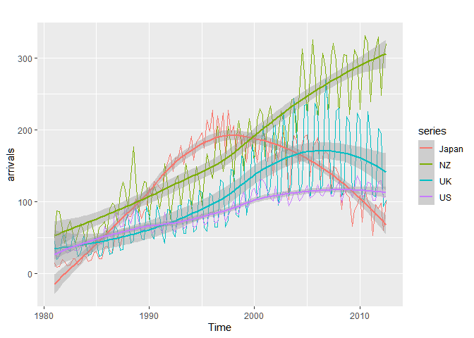
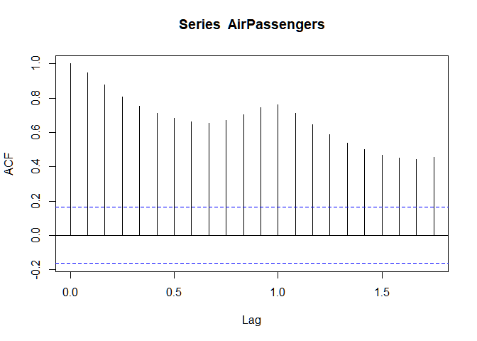
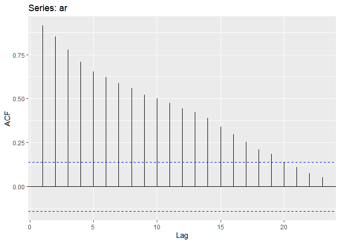

Untitled
================

``` r
library(tidyverse)
```

    ## Warning: package 'tidyverse' was built under R version 4.0.3

    ## -- Attaching packages --------------------------------------- tidyverse 1.3.0 --

    ## <U+221A> ggplot2 3.3.3     <U+221A> purrr   0.3.4
    ## <U+221A> tibble  3.0.4     <U+221A> dplyr   1.0.2
    ## <U+221A> tidyr   1.1.2     <U+221A> stringr 1.4.0
    ## <U+221A> readr   1.4.0     <U+221A> forcats 0.5.0

    ## Warning: package 'ggplot2' was built under R version 4.0.5

    ## Warning: package 'tibble' was built under R version 4.0.3

    ## Warning: package 'tidyr' was built under R version 4.0.3

    ## Warning: package 'readr' was built under R version 4.0.3

    ## Warning: package 'purrr' was built under R version 4.0.3

    ## Warning: package 'dplyr' was built under R version 4.0.3

    ## Warning: package 'stringr' was built under R version 4.0.3

    ## Warning: package 'forcats' was built under R version 4.0.3

    ## -- Conflicts ------------------------------------------ tidyverse_conflicts() --
    ## x dplyr::filter() masks stats::filter()
    ## x dplyr::lag()    masks stats::lag()

``` r
library(ggplot2)
library(magrittr)
```

    ## Warning: package 'magrittr' was built under R version 4.0.3

    ## 
    ## Attaching package: 'magrittr'

    ## The following object is masked from 'package:purrr':
    ## 
    ##     set_names

    ## The following object is masked from 'package:tidyr':
    ## 
    ##     extract

``` r
library(forecast)
```

    ## Warning: package 'forecast' was built under R version 4.0.3

    ## Registered S3 method overwritten by 'quantmod':
    ##   method            from
    ##   as.zoo.data.frame zoo

``` r
library(ggpmisc)
```

    ## Warning: package 'ggpmisc' was built under R version 4.0.3

    ## 
    ## Attaching package: 'ggpmisc'

    ## The following object is masked from 'package:ggplot2':
    ## 
    ##     annotate

``` r
library(fpp2)
```

    ## Warning: package 'fpp2' was built under R version 4.0.5

    ## -- Attaching packages ---------------------------------------------- fpp2 2.4 --

    ## <U+221A> fma       2.4     <U+221A> expsmooth 2.3

    ## Warning: package 'fma' was built under R version 4.0.5

    ## Warning: package 'expsmooth' was built under R version 4.0.5

    ## -- Conflicts ------------------------------------------------- fpp2_conflicts --
    ## x ggpmisc::annotate()   masks ggplot2::annotate()
    ## x magrittr::extract()   masks tidyr::extract()
    ## x magrittr::set_names() masks purrr::set_names()

``` r
AirPassengers
```

    ##      Jan Feb Mar Apr May Jun Jul Aug Sep Oct Nov Dec
    ## 1949 112 118 132 129 121 135 148 148 136 119 104 118
    ## 1950 115 126 141 135 125 149 170 170 158 133 114 140
    ## 1951 145 150 178 163 172 178 199 199 184 162 146 166
    ## 1952 171 180 193 181 183 218 230 242 209 191 172 194
    ## 1953 196 196 236 235 229 243 264 272 237 211 180 201
    ## 1954 204 188 235 227 234 264 302 293 259 229 203 229
    ## 1955 242 233 267 269 270 315 364 347 312 274 237 278
    ## 1956 284 277 317 313 318 374 413 405 355 306 271 306
    ## 1957 315 301 356 348 355 422 465 467 404 347 305 336
    ## 1958 340 318 362 348 363 435 491 505 404 359 310 337
    ## 1959 360 342 406 396 420 472 548 559 463 407 362 405
    ## 1960 417 391 419 461 472 535 622 606 508 461 390 432

``` r
str(AirPassengers)
```

    ##  Time-Series [1:144] from 1949 to 1961: 112 118 132 129 121 135 148 148 136 119 ...

``` r
summary(AirPassengers)
```

    ##    Min. 1st Qu.  Median    Mean 3rd Qu.    Max. 
    ##   104.0   180.0   265.5   280.3   360.5   622.0

``` r
length(AirPassengers)
```

    ## [1] 144

``` r
start(AirPassengers)
```

    ## [1] 1949    1

``` r
end(AirPassengers)
```

    ## [1] 1960   12

``` r
time(AirPassengers)
```

    ##           Jan      Feb      Mar      Apr      May      Jun      Jul      Aug
    ## 1949 1949.000 1949.083 1949.167 1949.250 1949.333 1949.417 1949.500 1949.583
    ## 1950 1950.000 1950.083 1950.167 1950.250 1950.333 1950.417 1950.500 1950.583
    ## 1951 1951.000 1951.083 1951.167 1951.250 1951.333 1951.417 1951.500 1951.583
    ## 1952 1952.000 1952.083 1952.167 1952.250 1952.333 1952.417 1952.500 1952.583
    ## 1953 1953.000 1953.083 1953.167 1953.250 1953.333 1953.417 1953.500 1953.583
    ## 1954 1954.000 1954.083 1954.167 1954.250 1954.333 1954.417 1954.500 1954.583
    ## 1955 1955.000 1955.083 1955.167 1955.250 1955.333 1955.417 1955.500 1955.583
    ## 1956 1956.000 1956.083 1956.167 1956.250 1956.333 1956.417 1956.500 1956.583
    ## 1957 1957.000 1957.083 1957.167 1957.250 1957.333 1957.417 1957.500 1957.583
    ## 1958 1958.000 1958.083 1958.167 1958.250 1958.333 1958.417 1958.500 1958.583
    ## 1959 1959.000 1959.083 1959.167 1959.250 1959.333 1959.417 1959.500 1959.583
    ## 1960 1960.000 1960.083 1960.167 1960.250 1960.333 1960.417 1960.500 1960.583
    ##           Sep      Oct      Nov      Dec
    ## 1949 1949.667 1949.750 1949.833 1949.917
    ## 1950 1950.667 1950.750 1950.833 1950.917
    ## 1951 1951.667 1951.750 1951.833 1951.917
    ## 1952 1952.667 1952.750 1952.833 1952.917
    ## 1953 1953.667 1953.750 1953.833 1953.917
    ## 1954 1954.667 1954.750 1954.833 1954.917
    ## 1955 1955.667 1955.750 1955.833 1955.917
    ## 1956 1956.667 1956.750 1956.833 1956.917
    ## 1957 1957.667 1957.750 1957.833 1957.917
    ## 1958 1958.667 1958.750 1958.833 1958.917
    ## 1959 1959.667 1959.750 1959.833 1959.917
    ## 1960 1960.667 1960.750 1960.833 1960.917

``` r
deltat(AirPassengers)
```

    ## [1] 0.08333333

``` r
frequency(AirPassengers)
```

    ## [1] 12

``` r
cycle(AirPassengers)
```

    ##      Jan Feb Mar Apr May Jun Jul Aug Sep Oct Nov Dec
    ## 1949   1   2   3   4   5   6   7   8   9  10  11  12
    ## 1950   1   2   3   4   5   6   7   8   9  10  11  12
    ## 1951   1   2   3   4   5   6   7   8   9  10  11  12
    ## 1952   1   2   3   4   5   6   7   8   9  10  11  12
    ## 1953   1   2   3   4   5   6   7   8   9  10  11  12
    ## 1954   1   2   3   4   5   6   7   8   9  10  11  12
    ## 1955   1   2   3   4   5   6   7   8   9  10  11  12
    ## 1956   1   2   3   4   5   6   7   8   9  10  11  12
    ## 1957   1   2   3   4   5   6   7   8   9  10  11  12
    ## 1958   1   2   3   4   5   6   7   8   9  10  11  12
    ## 1959   1   2   3   4   5   6   7   8   9  10  11  12
    ## 1960   1   2   3   4   5   6   7   8   9  10  11  12

``` r
plot(AirPassengers, xlab = "Year", ylab = "Number of passengers")
```

<!-- -->

``` r
miles<-c(412, 480, 683, 1052, 1385, 1418, 1634, NA, NA, 5948, 6109, 5981, 6753,
         8003, 10566, 12528, 14760, 16769, 19819, 22362, 25340, 25343, 29269, 30514)
miles[8:9] <- median(miles, na.rm = TRUE)
plot(miles)
```

<!-- -->

``` r
miles_ts<-ts(miles, start=1937, frequency = 1)
plot(miles_ts)
```

<!-- -->

``` r
is.ts(miles_ts)
```

    ## [1] TRUE

``` r
ts.plot(miles_ts, xlab="year", ylab="air passengers miles sum", main="TS plot")
```

<!-- -->

``` r
autoplot(AirPassengers)+
  geom_smooth()
```

    ## `geom_smooth()` using method = 'loess' and formula 'y ~ x'

<!-- -->

``` r
ggplot(AirPassengers, as.numeric = FALSE) + geom_line() +
  stat_peaks(colour = "red") +
  stat_peaks(geom = "text", colour = "red",
             vjust = -0.5, x.label.fmt = "%Y") +
  stat_valleys(colour = "blue") +
  stat_valleys(geom = "text", colour = "blue", angle = 45,
               vjust = 1.5, hjust = 1, x.label.fmt = "%Y")
```

<!-- -->

``` r
#zad1
#a
length(qcement)
```

    ## [1] 233

``` r
start(qcement)
```

    ## [1] 1956    1

``` r
end(qcement)
```

    ## [1] 2014    1

``` r
time(qcement)
```

    ##         Qtr1    Qtr2    Qtr3    Qtr4
    ## 1956 1956.00 1956.25 1956.50 1956.75
    ## 1957 1957.00 1957.25 1957.50 1957.75
    ## 1958 1958.00 1958.25 1958.50 1958.75
    ## 1959 1959.00 1959.25 1959.50 1959.75
    ## 1960 1960.00 1960.25 1960.50 1960.75
    ## 1961 1961.00 1961.25 1961.50 1961.75
    ## 1962 1962.00 1962.25 1962.50 1962.75
    ## 1963 1963.00 1963.25 1963.50 1963.75
    ## 1964 1964.00 1964.25 1964.50 1964.75
    ## 1965 1965.00 1965.25 1965.50 1965.75
    ## 1966 1966.00 1966.25 1966.50 1966.75
    ## 1967 1967.00 1967.25 1967.50 1967.75
    ## 1968 1968.00 1968.25 1968.50 1968.75
    ## 1969 1969.00 1969.25 1969.50 1969.75
    ## 1970 1970.00 1970.25 1970.50 1970.75
    ## 1971 1971.00 1971.25 1971.50 1971.75
    ## 1972 1972.00 1972.25 1972.50 1972.75
    ## 1973 1973.00 1973.25 1973.50 1973.75
    ## 1974 1974.00 1974.25 1974.50 1974.75
    ## 1975 1975.00 1975.25 1975.50 1975.75
    ## 1976 1976.00 1976.25 1976.50 1976.75
    ## 1977 1977.00 1977.25 1977.50 1977.75
    ## 1978 1978.00 1978.25 1978.50 1978.75
    ## 1979 1979.00 1979.25 1979.50 1979.75
    ## 1980 1980.00 1980.25 1980.50 1980.75
    ## 1981 1981.00 1981.25 1981.50 1981.75
    ## 1982 1982.00 1982.25 1982.50 1982.75
    ## 1983 1983.00 1983.25 1983.50 1983.75
    ## 1984 1984.00 1984.25 1984.50 1984.75
    ## 1985 1985.00 1985.25 1985.50 1985.75
    ## 1986 1986.00 1986.25 1986.50 1986.75
    ## 1987 1987.00 1987.25 1987.50 1987.75
    ## 1988 1988.00 1988.25 1988.50 1988.75
    ## 1989 1989.00 1989.25 1989.50 1989.75
    ## 1990 1990.00 1990.25 1990.50 1990.75
    ## 1991 1991.00 1991.25 1991.50 1991.75
    ## 1992 1992.00 1992.25 1992.50 1992.75
    ## 1993 1993.00 1993.25 1993.50 1993.75
    ## 1994 1994.00 1994.25 1994.50 1994.75
    ## 1995 1995.00 1995.25 1995.50 1995.75
    ## 1996 1996.00 1996.25 1996.50 1996.75
    ## 1997 1997.00 1997.25 1997.50 1997.75
    ## 1998 1998.00 1998.25 1998.50 1998.75
    ## 1999 1999.00 1999.25 1999.50 1999.75
    ## 2000 2000.00 2000.25 2000.50 2000.75
    ## 2001 2001.00 2001.25 2001.50 2001.75
    ## 2002 2002.00 2002.25 2002.50 2002.75
    ## 2003 2003.00 2003.25 2003.50 2003.75
    ## 2004 2004.00 2004.25 2004.50 2004.75
    ## 2005 2005.00 2005.25 2005.50 2005.75
    ## 2006 2006.00 2006.25 2006.50 2006.75
    ## 2007 2007.00 2007.25 2007.50 2007.75
    ## 2008 2008.00 2008.25 2008.50 2008.75
    ## 2009 2009.00 2009.25 2009.50 2009.75
    ## 2010 2010.00 2010.25 2010.50 2010.75
    ## 2011 2011.00 2011.25 2011.50 2011.75
    ## 2012 2012.00 2012.25 2012.50 2012.75
    ## 2013 2013.00 2013.25 2013.50 2013.75
    ## 2014 2014.00

``` r
deltat(qcement)
```

    ## [1] 0.25

``` r
frequency(qcement)
```

    ## [1] 4

``` r
cycle(qcement)
```

    ##      Qtr1 Qtr2 Qtr3 Qtr4
    ## 1956    1    2    3    4
    ## 1957    1    2    3    4
    ## 1958    1    2    3    4
    ## 1959    1    2    3    4
    ## 1960    1    2    3    4
    ## 1961    1    2    3    4
    ## 1962    1    2    3    4
    ## 1963    1    2    3    4
    ## 1964    1    2    3    4
    ## 1965    1    2    3    4
    ## 1966    1    2    3    4
    ## 1967    1    2    3    4
    ## 1968    1    2    3    4
    ## 1969    1    2    3    4
    ## 1970    1    2    3    4
    ## 1971    1    2    3    4
    ## 1972    1    2    3    4
    ## 1973    1    2    3    4
    ## 1974    1    2    3    4
    ## 1975    1    2    3    4
    ## 1976    1    2    3    4
    ## 1977    1    2    3    4
    ## 1978    1    2    3    4
    ## 1979    1    2    3    4
    ## 1980    1    2    3    4
    ## 1981    1    2    3    4
    ## 1982    1    2    3    4
    ## 1983    1    2    3    4
    ## 1984    1    2    3    4
    ## 1985    1    2    3    4
    ## 1986    1    2    3    4
    ## 1987    1    2    3    4
    ## 1988    1    2    3    4
    ## 1989    1    2    3    4
    ## 1990    1    2    3    4
    ## 1991    1    2    3    4
    ## 1992    1    2    3    4
    ## 1993    1    2    3    4
    ## 1994    1    2    3    4
    ## 1995    1    2    3    4
    ## 1996    1    2    3    4
    ## 1997    1    2    3    4
    ## 1998    1    2    3    4
    ## 1999    1    2    3    4
    ## 2000    1    2    3    4
    ## 2001    1    2    3    4
    ## 2002    1    2    3    4
    ## 2003    1    2    3    4
    ## 2004    1    2    3    4
    ## 2005    1    2    3    4
    ## 2006    1    2    3    4
    ## 2007    1    2    3    4
    ## 2008    1    2    3    4
    ## 2009    1    2    3    4
    ## 2010    1    2    3    4
    ## 2011    1    2    3    4
    ## 2012    1    2    3    4
    ## 2013    1    2    3    4
    ## 2014    1

``` r
plot(qcement, xlab = "Year", ylab = "Number of passengers")
```

<!-- -->

``` r
#b
ozonet_airquality<-airquality[62:153,c('Ozone', 'Temp')]
colSums(is.na(ozonet_airquality))
```

    ## Ozone  Temp 
    ##    11     0

``` r
ozonet_airquality$Ozone<-ifelse(is.na(ozonet_airquality$Ozone), 
                                ave(ozonet_airquality$Ozone, FUN = function(x) mean(x, na.rm = TRUE)),
                                ozonet_airquality$Ozone)
colSums(is.na(ozonet_airquality))
```

    ## Ozone  Temp 
    ##     0     0

``` r
ozonet_airquality_ts <- ts(ozonet_airquality, start=1, frequency=365)
autoplot(ozonet_airquality_ts, facets = TRUE)
```

<!-- -->

``` r
#c

autoplot(arrivals)+
  geom_smooth()
```

    ## `geom_smooth()` using method = 'loess' and formula 'y ~ x'

<!-- -->

``` r
ggplot(arrivals, as.numeric = FALSE) + geom_line() +
  stat_peaks(colour = "red") +
  stat_peaks(geom = "text", colour = "red",
             vjust = -0.5, x.label.fmt = "%Y") +
  stat_valleys(colour = "blue") +
  stat_valleys(geom = "text", colour = "blue", angle = 45,
               vjust = 1.5, hjust = 1, x.label.fmt = "%Y") +
  ggtitle('Arrivals Japan')
```

<!-- -->

``` r
acf(AirPassengers)
```

<!-- -->

``` r
pacf(AirPassengers)
```

<!-- -->

``` r
ggAcf(AirPassengers, type="correlation")
```

<!-- -->

``` r
ggPacf(AirPassengers)
```

<!-- -->

``` r
#b
white_noise <- arima.sim(model = list(order = c(0, 0, 0)), n = 100)
rw_drift <- arima.sim(model = list(order = c(0, 1, 0)), n = 100, mean = 0.1)
ar <- arima.sim(model = list(ar = 0.5), n = 100)
ma<-arima.sim(model = list(ma =-0.9), n = 100, mean=2)
autoplot(cbind(white_noise, rw_drift, ar, ma))
```

<!-- -->

``` r
rw_drift_diff<-diff(rw_drift)
autoplot(cbind(rw_drift, rw_drift_diff))
```

<!-- -->

``` r
#c
ggseasonplot(AirPassengers, year.labels=TRUE)
```

<!-- -->

``` r
ggseasonplot(AirPassengers, year.labels=FALSE, col=rainbow(12), polar=TRUE)
```

<!-- -->

``` r
ggsubseriesplot(AirPassengers)
```

<!-- -->

``` r
#Zad2
#a
qcement_acf<-acf(qcement)
```

<!-- -->

``` r
qcement_acf$acf[10]
```

    ## [1] 0.7994303

``` r
ggAcf(qcement, lag.max = 30, type="correlation")
```

<!-- -->

``` r
qcement_pacf<-pacf(qcement)
```

<!-- -->

``` r
qcement_pacf$acf[20]
```

    ## [1] 0.02065536

``` r
ggPacf(qcement, lag.max = 30)
```

<!-- -->

``` r
ggseasonplot(qcement, year.labels=TRUE)
```

<!-- -->

``` r
ggseasonplot(qcement, year.labels=FALSE, col=rainbow(58), polar=TRUE)
```

<!-- -->

``` r
ggsubseriesplot(qcement)
```

<!-- -->

``` r
ozonet_acf<-acf(ozonet_airquality)
```

<!-- -->

``` r
ozonet_acf$acf[10]
```

    ## [1] 0.01783739

``` r
ggAcf(ozonet_airquality, lag.max = 30, type="correlation")
```

<!-- -->

``` r
ozonet_pacf<-pacf(ozonet_airquality)
```

<!-- -->

``` r
ozonet_pacf$acf[20]
```

    ## [1] 0.009416098

``` r
ggPacf(ozonet_airquality, lag.max = 30)
```

<!-- -->

``` r
#b
ma<-arima.sim(model = list(ma =-0.9), n = 200, mean=5)
ar <-arima.sim(model = list(ar = 0.9), n = 200, mean=-1)
drift <- arima.sim(model = list(order = c(0, 1, 0)), n = 200)
autoplot(cbind(drift, ar, ma))
```

<!-- -->

``` r
ggAcf(ma)
```

<!-- -->

``` r
ggAcf(ar)
```

<!-- -->

``` r
ggAcf(drift)
```

<!-- -->

``` r
ggPacf(ma)
```

<!-- -->

``` r
ggPacf(ar)
```

<!-- -->

``` r
ggPacf(drift)
```

<!-- -->

``` r
#c
df<- visnights[,1:5]
df
```

    ##         NSWMetro NSWNthCo NSWSthCo NSWSthIn NSWNthIn
    ## 1998 Q1 9.047095 8.565678 5.818029 2.679538 2.977507
    ## 1998 Q2 6.962126 7.124468 2.466437 3.010732 3.477703
    ## 1998 Q3 6.871963 4.716893 1.928053 3.328869 3.014770
    ## 1998 Q4 7.147293 6.269299 2.797556 2.417772 3.757972
    ## 1999 Q1 7.956923 9.493901 4.853681 3.224285 3.790760
    ## 1999 Q2 6.542243 5.401201 2.759843 2.428489 3.395284
    ## 1999 Q3 6.330364 5.542626 2.041827 2.893273 3.626120
    ## 1999 Q4 7.509212 6.383474 2.650677 2.814578 3.691498
    ## 2000 Q1 7.662491 8.337008 5.367951 2.553072 3.135834
    ## 2000 Q2 6.341802 4.923476 3.460795 2.368211 2.824604
    ## 2000 Q3 7.827301 5.134491 1.606173 2.934893 3.390675
    ## 2000 Q4 9.579562 6.389888 2.563254 2.561272 2.946215
    ## 2001 Q1 8.270488 8.259398 4.913846 2.378108 3.117019
    ## 2001 Q2 7.240427 5.442669 3.143754 2.881288 2.967460
    ## 2001 Q3 6.640490 5.767428 1.776069 2.470918 3.111254
    ## 2001 Q4 7.111875 5.611910 2.437988 2.508259 2.778671
    ## 2002 Q1 6.827826 9.504843 4.503678 2.539149 3.246055
    ## 2002 Q2 6.404992 6.032525 2.738989 2.325263 3.182464
    ## 2002 Q3 6.615760 5.824036 2.597074 3.618077 3.550722
    ## 2002 Q4 7.226376 6.521765 3.036104 2.556570 3.654710
    ## 2003 Q1 7.589058 8.985048 5.347349 2.645302 2.530093
    ## 2003 Q2 6.334527 5.586264 2.468439 2.613192 3.022613
    ## 2003 Q3 5.996748 5.458092 1.839535 3.028606 3.138256
    ## 2003 Q4 6.612846 6.451382 2.790801 2.592156 2.748981
    ## 2004 Q1 7.758267 8.562403 5.079241 2.641146 3.113590
    ## 2004 Q2 6.778836 5.769052 2.218587 2.277138 3.441846
    ## 2004 Q3 5.854452 5.436794 1.974140 3.065055 3.361805
    ## 2004 Q4 6.200214 5.997550 2.447396 2.919319 3.927408
    ## 2005 Q1 7.163830 8.561084 5.113689 3.308873 3.760009
    ## 2005 Q2 5.082204 5.177718 1.848187 2.683127 2.866940
    ## 2005 Q3 5.673551 5.061628 1.741660 2.680040 3.101610
    ## 2005 Q4 6.089906 5.131793 2.348097 1.769948 2.832297
    ## 2006 Q1 8.525916 7.948299 5.067586 2.452971 2.986351
    ## 2006 Q2 6.569684 6.220572 2.359089 2.177672 2.849455
    ## 2006 Q3 5.771059 5.720923 1.799049 2.776814 2.925707
    ## 2006 Q4 6.692897 5.861450 2.705539 1.963298 2.885646
    ## 2007 Q1 8.158658 8.492911 4.059228 2.490456 3.101674
    ## 2007 Q2 5.710082 5.638543 2.422243 2.499155 3.334823
    ## 2007 Q3 5.402543 5.206903 1.571916 2.554703 2.822156
    ## 2007 Q4 6.803494 6.495867 2.123589 2.256979 2.665508
    ## 2008 Q1 7.866269 8.859705 5.057995 2.485871 3.282456
    ## 2008 Q2 5.616704 5.169616 2.225727 1.961535 2.944495
    ## 2008 Q3 5.886764 4.677335 1.688608 2.429234 2.772693
    ## 2008 Q4 5.506298 6.063174 2.551046 2.567851 2.892727
    ## 2009 Q1 6.787225 8.396070 4.642889 2.036539 2.631521
    ## 2009 Q2 5.361317 4.701396 2.122635 1.992129 2.649392
    ## 2009 Q3 4.699350 4.702031 1.260896 2.967096 2.860450
    ## 2009 Q4 6.208784 6.590313 2.394691 2.272564 2.706988
    ## 2010 Q1 7.148262 7.674930 4.638232 2.170557 2.695945
    ## 2010 Q2 4.850217 4.886140 1.869805 2.141073 3.208042
    ## 2010 Q3 6.029490 5.601451 1.585782 3.328250 2.828116
    ## 2010 Q4 6.238903 5.681885 2.287808 2.302143 2.621650
    ## 2011 Q1 7.597468 8.297532 4.553496 2.222262 2.528372
    ## 2011 Q2 5.815930 6.003609 2.210699 2.087470 3.003445
    ## 2011 Q3 6.183239 5.043017 1.971881 3.367905 2.932657
    ## 2011 Q4 5.929030 6.141692 1.990592 2.167218 2.840003
    ## 2012 Q1 7.986931 8.230658 4.547833 2.096284 2.863153
    ## 2012 Q2 5.307871 5.215309 2.216256 2.321956 3.344971
    ## 2012 Q3 6.054112 5.680582 1.463597 2.534728 2.833961
    ## 2012 Q4 6.023897 6.818513 2.303389 2.424836 3.255881
    ## 2013 Q1 7.028480 7.764270 5.027767 2.956587 3.443175
    ## 2013 Q2 5.813450 5.272603 2.331858 2.238851 2.951808
    ## 2013 Q3 6.322841 5.254358 2.027862 2.711374 2.830805
    ## 2013 Q4 7.101691 6.521979 2.769249 2.329302 2.602072
    ## 2014 Q1 7.897316 8.563474 4.209300 2.731191 2.582000
    ## 2014 Q2 5.997468 6.005911 2.400496 2.685632 2.868704
    ## 2014 Q3 6.033533 5.846873 1.662338 2.896298 2.948054
    ## 2014 Q4 7.103398 5.790289 2.831355 2.400582 3.754855
    ## 2015 Q1 8.725132 7.875725 4.811783 2.459822 2.718823
    ## 2015 Q2 6.995875 6.021249 2.766103 2.210963 3.445121
    ## 2015 Q3 6.294490 5.486429 2.097544 3.079726 2.877699
    ## 2015 Q4 6.945476 6.818165 2.561440 2.630874 3.776077
    ## 2016 Q1 7.373757 9.945415 4.789194 2.767853 2.871376
    ## 2016 Q2 6.792234 6.664099 2.320229 2.691365 3.928462
    ## 2016 Q3 6.530568 5.978458 1.651091 3.269565 3.514431
    ## 2016 Q4 7.878277 7.362045 2.713210 2.739392 3.490721

``` r
summary(df)
```

    ##     NSWMetro        NSWNthCo        NSWSthCo        NSWSthIn    
    ##  Min.   :4.699   Min.   :4.677   Min.   :1.261   Min.   :1.770  
    ##  1st Qu.:6.028   1st Qu.:5.454   1st Qu.:2.038   1st Qu.:2.324  
    ##  Median :6.628   Median :6.005   Median :2.457   Median :2.554  
    ##  Mean   :6.721   Mean   :6.455   Mean   :2.912   Mean   :2.586  
    ##  3rd Qu.:7.230   3rd Qu.:7.440   3rd Qu.:3.610   3rd Qu.:2.786  
    ##  Max.   :9.580   Max.   :9.945   Max.   :5.818   Max.   :3.618  
    ##     NSWNthIn    
    ##  Min.   :2.528  
    ##  1st Qu.:2.834  
    ##  Median :2.982  
    ##  Mean   :3.097  
    ##  3rd Qu.:3.369  
    ##  Max.   :3.928

``` r
str(df)
```

    ##  Time-Series [1:76, 1:5] from 1998 to 2017: 9.05 6.96 6.87 7.15 7.96 ...
    ##  - attr(*, "dimnames")=List of 2
    ##   ..$ : NULL
    ##   ..$ : chr [1:5] "NSWMetro" "NSWNthCo" "NSWSthCo" "NSWSthIn" ...

``` r
length(df)
```

    ## [1] 380

``` r
start(df)
```

    ## [1] 1998    1

``` r
end(df)
```

    ## [1] 2016    4

``` r
colSums(is.na(df))
```

    ## NSWMetro NSWNthCo NSWSthCo NSWSthIn NSWNthIn 
    ##        0        0        0        0        0

``` r
plot(df)
```

<!-- -->

``` r
ggAcf(df)
```

<!-- -->

``` r
ggPacf(df)
```

<!-- -->
