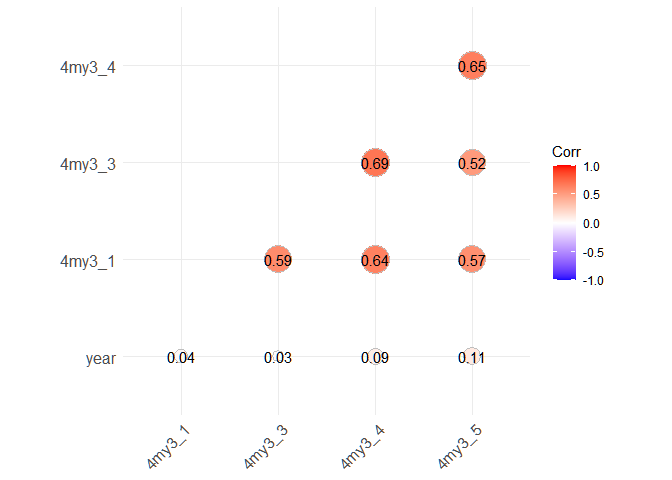

Untitled
================

``` r
library(tidyverse)
```

    ## Warning: package 'tidyverse' was built under R version 4.0.3

    ## -- Attaching packages --------------------------------------- tidyverse 1.3.0 --

    ## <U+221A> ggplot2 3.3.3     <U+221A> purrr   0.3.4
    ## <U+221A> tibble  3.0.4     <U+221A> dplyr   1.0.2
    ## <U+221A> tidyr   1.1.2     <U+221A> stringr 1.4.0
    ## <U+221A> readr   1.4.0     <U+221A> forcats 0.5.0

    ## Warning: package 'ggplot2' was built under R version 4.0.5

    ## Warning: package 'tibble' was built under R version 4.0.3

    ## Warning: package 'tidyr' was built under R version 4.0.3

    ## Warning: package 'readr' was built under R version 4.0.3

    ## Warning: package 'purrr' was built under R version 4.0.3

    ## Warning: package 'dplyr' was built under R version 4.0.3

    ## Warning: package 'stringr' was built under R version 4.0.3

    ## Warning: package 'forcats' was built under R version 4.0.3

    ## -- Conflicts ------------------------------------------ tidyverse_conflicts() --
    ## x dplyr::filter() masks stats::filter()
    ## x dplyr::lag()    masks stats::lag()

``` r
library(ggplot2)
library(dplyr)
library(readr)
library(ggcorrplot)
```

    ## Warning: package 'ggcorrplot' was built under R version 4.0.3

``` r
chronologies <- read_delim("J.txt", "\t", escape_double = FALSE, 
                trim_ws = TRUE)
```

    ## 
    ## -- Column specification --------------------------------------------------------
    ## cols(
    ##   year = col_double(),
    ##   `4my3_1` = col_double(),
    ##   `4my3_3` = col_double(),
    ##   `4my3_4` = col_double(),
    ##   `4my3_5` = col_double()
    ## )

``` r
summary1<-matrix(c(round(sapply(chronologies, mean),2),
                   sapply(chronologies, min),
                   sapply(chronologies, max),
                   round(sapply(chronologies, sd),2),
                   sapply(chronologies, median)),
                 nrow = ncol(chronologies), ncol = 5)

rownames(summary1)<-colnames(chronologies)
colnames(summary1)<-c("Mean", "Min", "Max", "Std", "Median")

write_delim(data.frame(summary1),"chronologies_stat.txt")

corr<-cor(chronologies)
ggcorrplot(corr, method='circle', type='lower', lab=TRUE)
```

<!-- -->

``` r
dev.copy(png, 'chronologies_corr.png')
```

    ## png 
    ##   3

``` r
dev.off()
```

    ## png 
    ##   2
